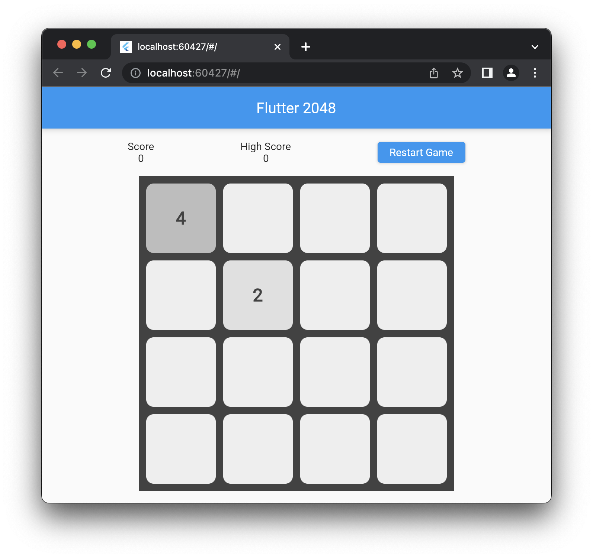

## Flutter 2048

A Flutter implementation of the classic 2048 game.

### Screenshots

### Getting Started

1. Install Flutter: https://flutter.dev/docs/get-started/install
2. Clone this repository: `git clone https://github.com/username/flutter-2048.git`
3. Navigate to the cloned repository: `cd flutter-2048`
4. Run the app: `flutter run`

### How to Play

1. Use the arrow keys to move the tiles in the desired direction.
2. Tiles with the same number merge into a new tile with double the value.
3. The goal is to get a tile with the value of 2048.

### Credits

This game was created by following the tutorial at https://www.raywenderlich.com/4333659-how-to-make-a-2048-game-in-flutter

### License

This project is licensed under the MIT License - see the LICENSE file for details.
